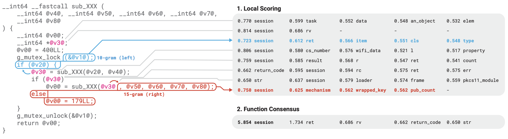

# STRIDE: Simple Type Recognition In Decompiled Executables



**STRIDE** is an extremely simple technique for predicting **variable names** and **variable types** in decompiled code using N-grams. We found that it is possible to learn the *context* in which variables appear (i.e. the surrounding tokens) in a large training corpus, then at inference time identify variables which appear in the same contexts. *Think IDA FLIRT, but we're predicting variable types/names instead of functions and we're working with decompiler tokens (i.e. code tokens) instead of bytes.*

In our evaluation, STRIDE achieved SOTA performance at variable renaming and retyping on three C/C++ datasets while also being *much faster* than recent transformer-based approaches, without requiring a GPU. In a CPU-only head-to-head, STRIDE is **>40x faster** than [VarBERT](https://github.com/sefcom/VarBERT) and **>210x faster** than [DIRTY](https://github.com/CMUSTRUDEL/DIRTY). When the other systems are provided a NVIDIA L4 GPU, STRIDE is still >5x faster than VarBERT and >25x faster than DIRTY.

Check out our recent paper (https://arxiv.org/abs/2407.02733) for a detailed description of the approach and comprehensive evaluation with existing techniques. Below you will find an abbreviated explanation of the approach and details on running our research prototype.

---

# How it works: human-inspired design

When *human* reverse engineers look at a stripped binary and try to figure out what types and names to assign to variables, the most important feature is observing _how_ the variables are being used. For example, a variable that appears in code like `open(x, ...)` is probably a `fd`. A variable that appears in a loop like this: `for (; x != NULL; x = *x)` is probably a linked list (where `*x` represents `x->next`). A variable that appears in code like this:
```
if (*x > *(x+8)) {
    *(x+16) + ((*x) * 8) = ...
    *x += 1;
}
```
is probably some sort of `vec` structure:
```c
struct {
    uint64_t size;     // (x)
    uint64_t capacity; // (x+8)
    void *data;        // (x+16)
}
```

While it is possible to define complex static analysis techniques that identify these types of patterns (and indeed this has been done to moderate extent) -- humans take a more approximate strategy, guessing structures and types that seem to match the observed patterns, even if these guesses are not 100% sound.

**STRIDE** performs this type of human-centric pattern recognition _automatically_ using a simple N-gram technique. In short, we first consume a large corpus of training data consisting of decompiled code where the variables and types have known names.

Next, we look at the *sequences* of tokens to the left and the right of each place the variable appears in the decompilation. These N-gram sequences map to the *most frequent* variable type or name we've seen in that context.

At runtime, when looking at a new piece of code, we check if any of the sequences to the left and right of these variables map to sequences we've seen before in the training data. If we find a variable that appears in *exactly* the same context it probably has the same type and name as the one we saw before (especially if we're able to match a very long sequence of tokens).

For STRIDE, we sprinkle a little bit of post-processing on top in order to compute scores across a whole function (where variables appear multiple times) and generated weighted predictions. We also implement a more efficient hash-based N-gram lookup that enables fast predictions.

---

# FAQ

> Can it work with other languages / other decompilers / other architectures / different optimization levels?

We tested STRIDE on decompiled x86 C/C++ code in Ghidra and IDA Pro from O0-O3. However, nothing about the approach is language-, architecture-, or decompiler-specific. As long as you train the model on a dataset constructed in the same way, it should probably work. However, because the model is explicitly matching N-gram sequences, a model trained on Ghidra probably won't transfer to IDA Pro because the decompiler token formatting is quite different.

The main reason we don't evaluate on more combinations is because it is hard to construct these datasets. Generating ground truth types/names for decompiled text currently requires decompiling with DWARF info and then manually stripping types/names. Some decompilers (Ghidra to some extent, Binary Ninja, etc...) have very limited support for parsing DWARF info. And even decompilers that are really good at it (IDA Pro) have limited support for DWARF on architectures other than x86.

> Can it generate new names / predict unseen types?

No, STRIDE is performing _classification_ and can only predict names/types seen during training. While transformer models like DIRTY can _theoretically_ predict entirely new names, STRIDE is still able to beat DIRTY at renaming accuracy on the DIRT dataset.

> How well will it work on my real world stripped binaries?

Since STRIDE performs _classification_ (see above), we only expect it to work well when the types/names in the target binary are ones you expect have been encountered in the training data. For example, consider these scenarios:

- **stripped version of popular open source library** -- STRIDE probably works very well, however it may be effective to perform function matching i.e. with FLIRT.
- **custom binary with statically linked open source library** -- STRIDE probably works well to identify the library types that are used in the code, especially beneficial at higher optimization levels when functions might get inlined / merged and not match FLIRT signatures.
- **completely custom closed source binary** -- STRIDE probably does not work very well, if any of the types happen to match ones seen in training, it may identify them (i.e. think common small data structure types), however on completely custom large structs it won't identify these.

Since STRIDE is fairly lightweight, one additional interesting application could be to bootstrap STRIDE on a work-in-progress decompiled binary for some large closed source project. For example, if you've manually reverse-engineered several structs in a large proprietary codebase, it could be interesting to train a small STRIDE model on these instances and then run it on the rest of the binary to find similar contexts.

> Is there a decompiler plugin available?

Not yet, but we are interested in making one. If you want to help, feel free to reach out!

---

The rest of this repository contains a research prototype of **STRIDE** designed to work with the DIRE, DIRT, and VarCorpus datasets.

# Dataset

STRIDE is designed to work with the DIRE, DIRT and VarCorpus datasets. In order to use them, you will need to download the respective datasets and use the converter scripts to convert into the internal STRIDE format.

## DIRE

Download the dataset from https://drive.google.com/drive/folders/19Rf7NtW56r6fz-ycldZq9hjxNr5osAJW

Unpack into `./dire`

Make a new directory `./stride_dire`

Run the converter:

```bash
python3 -m stride.converters.dire \
    ./dire \
    ./stride_dire
```

## DIRT

Download the dataset with:

```bash
wget cmu-itl.s3.amazonaws.com/dirty/dirt.tar.gz -O dirt.tar.gz
tar -xzf dirt.tar.gz
```

Make a new directory `./stride_dirt`

Run the converter:

```bash
python3 -m stride.converters.dirt \
    ./data1 \
    ./stride_dirt
```

## VarCorpus

Download the dataset splits from: https://www.dropbox.com/scl/fo/3thmg8xoq2ugtjwjcgjsm/h?rlkey=azgjeq513g4semc1qdi5xyroj&dl=0

For each split, make a new directory, e.g. `./ida_0_pb`

Run the converter for the train and test file:

```bash
python3 -m stride.converters.varcorpus \
    ./VarCorpus/IDA-O0/transfer_IDA_O0/per-binary/final_train.jsonl \
    ./ida_0_pb/converted_train.jsonl

python3 -m stride.converters.varcorpus \
    ./VarCorpus/IDA-O0/transfer_IDA_O0/per-binary/final_test.jsonl \
    ./ida_0_pb/converted_test.jsonl
```

# Building the N-gram database

Note `$STRIDE_DATA` refers to one of the dataset folders created in the first step containing a `converted_train.jsonl` and `converted_test.jsonl`.

First build the vocab file:

**Variable renaming:**

```bash
python3 -m stride.tools.build_vocab \
    $STRIDE_DATA/converted_train.jsonl \
    $STRIDE_DATA/name.vocab \
    --type name
```

**Variable retyping:**

(only applies to the DIRT dataset)

```bash
python3 -m stride.tools.build_vocab \
    $STRIDE_DATA/converted_train.jsonl \
    $STRIDE_DATA/type.vocab \
    --type type
```

Next build the N-gram databases for each N:

```bash
python3 -m stride.tools.build_ngram_db_multi \
    $STRIDE_DATA/converted_train.jsonl \
    $STRIDE_DATA/name.vocab \ # or type.vocab
    $STRIDE_DATA/ngram.10.db \ # ngram.N.db
    --type name \ # or type
    --size 10 \ # N
    --topk 5 \
    --flanking
```

# Generating predictions

Use the `run_eval` script to make predictions:

```bash
python3 -m stride.tools.run_eval \
    $STRIDE_DATA/converted_test.jsonl \
    $STRIDE_DATA/name.vocab \ # or type.vocab
    $STRIDE_DATA/out.csv \
    --nproc 10 \ # can run predictions in parallel
    --flanking \
    --dbs \
        $ROOT/ngram.60.db \
        $ROOT/ngram.30.db \
        $ROOT/ngram.15.db \
        $ROOT/ngram.14.db \
        $ROOT/ngram.13.db \
        $ROOT/ngram.12.db \
        $ROOT/ngram.11.db \
        $ROOT/ngram.10.db \
        $ROOT/ngram.9.db \
        $ROOT/ngram.8.db \
        $ROOT/ngram.7.db \
        $ROOT/ngram.6.db \
        $ROOT/ngram.5.db \
        $ROOT/ngram.4.db \
        $ROOT/ngram.3.db \
        $ROOT/ngram.2.db
```

